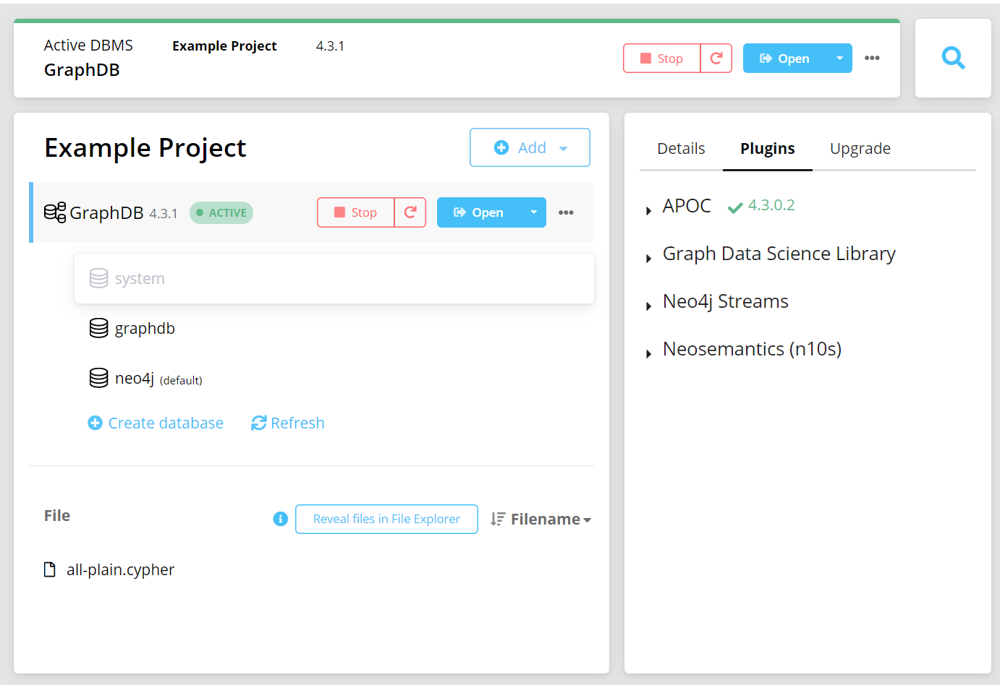

# SDP4Backend
### The Graphql API
### Setup
#### __Neo4J database__
 - Install neo4j database from [here](https://neo4j.com/docs/desktop-manual/current/installation/).
 - Open neo4j desktop app and create a database named as 'graphdb'.
 - Install APOC plugins as shown in the below screenshot.
 - Verify if the database is running by opening http://localhost:7474/browser/
 - Import dumps
    - Click on "Reveal files in File Explorer" and copy the "all-plain.cypher" file from this repository and paste it in the location.
    - Clear your Neo4j database and remove all indexes by inserting the following two lines of code:	

        - `MATCH (n) DETACH DELETE n;`

        - `CALL apoc.schema.assert({},{},true);`

    - Upload the dump by running the following line: 
        - `CALL apoc.cypher.runFile(<filename>)`

 

#### Graphql API
 - Clone this repository and run below commands in the root folder.
    - `npm install`
    - `cd api && npm install`
    - `cd .. && npm run start`
    - rename .envlocal to .env file and update neo4j db credentials
    - The `NEO4J_URI=bolt://localhost:7687` can be found by clicking on the database and looking at the details for "Bolt port".
    - The `NEO4J_USER=neo4j` can be found by using the command "SHOW USERS" in Neo4j.
    - The `NEO4J_PASSWORD=admin` is the password used when creating the database, and can be reset using the "Reset DBMS password" feature in the details pane of the database.
    - The `NEO4J_DATABASE=neo4j` can be found by using the command "SHOW DATABASES" in Neo4j.

 - Verify the running server by opening http://localhost:4001/graphql
